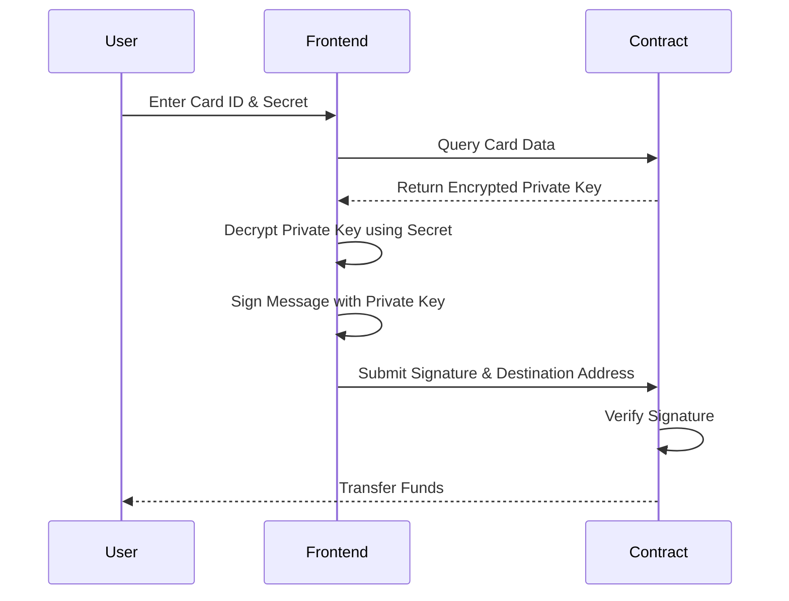

# Card Security

UniVoucher's security model uses advanced cryptography to ensure that only the intended recipient can redeem a gift card. This page explains the technical details of the security mechanisms.

!!! abstract "Security Overview"
    UniVoucher uses a combination of asymmetric cryptography, key encryption, and zero-knowledge proofs to create a secure tangible gifting mechanism that doesn't require pre-registration of recipients.

## Cryptographic Model

### Key Components

Each UniVoucher tangible gift card includes these cryptographic components:

1. **Key Pair**: A unique Ethereum key pair (public and private key)
2. **Slot ID**: The public key, used as the card's on-chain identifier
3. **User-Friendly Secret**: A 20-character redemption code (format: XXXXX-XXXXX-XXXXX-XXXXX)
4. **Encrypted Private Key**: The card's private key, encrypted with the user-friendly secret

### Security Flow

The security model follows this flow:

=== "Card Creation"
    1. Generate a random Ethereum key pair
    2. Generate a user-friendly secret with sufficient entropy
    3. Encrypt the private key using the secret
    4. Store the encrypted private key and public key on the blockchain
    5. Share the card ID and secret with the recipient (off-chain)

=== "Card Redemption"
    1. Recipient enters the card ID and secret
    2. System retrieves the encrypted private key from the blockchain
    3. System decrypts the private key using the provided secret
    4. System creates a cryptographic signature with the decrypted private key
    5. Smart contract verifies the signature against the stored public key
    6. If verified, funds are transferred to the recipient's address

## Encryption Details

### Secret Generation

The user-friendly secret is generated with these characteristics:

- Format: XXXXX-XXXXX-XXXXX-XXXXX (20 letters, 23 characters including hyphens)
- Character set: Uppercase English alphabet (A-Z)
- Entropy: At least 70 bits of entropy, providing sufficient security
- Generation method: Cryptographically secure random generation

!!! example "Example Secret"
    ```
    FKTML-XNPRQ-ZASEV-BGUCH
    ```

### Private Key Encryption

Private keys are encrypted using:

1. **Key Derivation**: PBKDF2 with these parameters:
   - Salt: 16 random bytes unique to each encryption
   - Iterations: 310,000 rounds
   - Hash function: SHA-256
   - Output key size: 256 bits

2. **Encryption Algorithm**: AES-GCM with these parameters:
   - Key: The derived key from step 1
   - IV: 12 random bytes unique to each encryption
   - Authentication tag: Included to verify decryption integrity

3. **Storage Format**: JSON with these fields:
   ```json
   {
     "salt": "hex_encoded_salt",
     "iv": "hex_encoded_initialization_vector",
     "ciphertext": "base64_encoded_encrypted_private_key"
   }
   ```

## Signature Verification

During redemption, the contract uses a signature verification process:



1. The decrypted private key signs a specific message containing:
   - A prefix: "Redeem card:"
   - The card ID: Unique identifier
   - A destination prefix: "to:"
   - The recipient address: Where funds will be sent

2. The smart contract:
   - Constructs the same message
   - Recovers the signer address from the provided signature
   - Verifies that the recovered address matches the card's slot ID (public key)
   - If verified, proceeds with the transfer

This proves that the redeemer knows the private key (via the secret) without revealing it.

## Security Guarantees

!!! success "Security Guarantees"
    This security model provides several guarantees:

    1. **Secret Confidentiality**: The card secret is never stored on-chain
    2. **Zero Knowledge**: The redemption proves knowledge of the secret without revealing it
    3. **Non-Transferability**: The signature is bound to a specific recipient address
    4. **Tamper Resistance**: Any change to the encrypted data would prevent successful decryption
    5. **Brute Force Protection**: The PBKDF2 key derivation is computationally expensive to brute force

## Client-Side Security

The client-side application includes additional security features:

1. **Secure Key Handling**:
   - Private keys are only ever held in memory temporarily
   - Keys are never sent to any server
   - All cryptographic operations happen in the user's browser

2. **Secret Input Handling**:
   - Automatic formatting of secrets for better readability
   - Case-insensitive handling
   - Validation before submission

3. **Distribution Security**:
   - Generated cards are available for immediate download
   - Cards can be downloaded as plain text or CSV files
   - Clear instructions encourage secure distribution of secrets

## Security Considerations

!!! warning "Security Considerations"
    While the cryptographic model is robust, users should be aware of these considerations:

    1. **Secret Distribution**: The security depends on the secret being shared securely
    2. **Secret Storage**: Recipients should store the secret securely until redemption
    3. **Front-End Security**: Users should always verify they're on the authentic UniVoucher website
    4. **Phishing Risk**: Attackers might create fake interfaces to steal card secrets

## Smart Contract Security

The smart contract includes security features to prevent common attacks:

| Feature | Description |
| ------- | ----------- |
| **Reentrancy Protection** | Functions that modify state are protected against reentrancy |
| **Access Controls** | Only card creators can cancel their cards |
| **Signature Replay Prevention** | Each signature can only be used once |
| **Input Validation** | All inputs are validated before processing |

## Cancellation Security

Card cancellation requires:

1. The transaction sender must be the original card creator
2. The card must still be active (not redeemed)
3. A signed transaction from the creator's wallet

## Abandonment Protection

!!! info "Abandonment Protection"
    To prevent permanent fund loss:

    1. Cards include a 5-year abandonment period
    2. After this period, the contract owner can intervene
    3. This appears as an "Abandoned On" date in the card details
    4. In normal circumstances, creators can cancel cards at any time

## Security Recommendations

For maximum security, we recommend:

1. Share card IDs and secrets through separate secure channels
2. Use temporary/expiring messaging when possible
3. Verify with recipients when they've successfully redeemed
4. Cancel cards promptly if they're compromised or no longer needed
5. Use a hardware wallet for creating high-value cards

!!! tip "Best Practice"
    When sending a gift card, consider sending the card ID and secret through different communication channels. For example, send the card ID via email and the secret via a messaging app.
