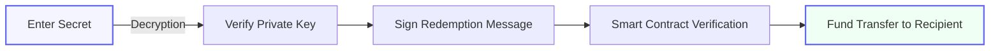
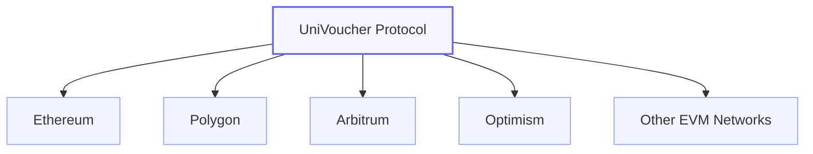

# How UniVoucher Works

UniVoucher creates a unique and first-of-its-kind decentralized tangible crypto gift card system using smart contracts and cryptography. This page explains the underlying mechanics that power the platform.

!!! abstract "Overview"
    UniVoucher utilizes public-key cryptography, secure encryption, and blockchain smart contracts to enable trustless tangible gift cards without requiring recipient registration, accounts, or central authorities.

## The Cryptographic Model

UniVoucher uses a cryptographic approach to enable secure, trustless tangible gift cards that are non-custodial, accessible to anyone worldwide, and require no account registration:

### Card Creation Process

When a card is created:

-   :material-key-plus:{ .lg .middle } __Key Generation__

    The system generates a random keypair (public and private key)
    
    - The public key serves as the card's "slot ID"
    - The private key is necessary for redemption
    ---

-   :material-lock-check:{ .lg .middle } __Secret Creation__

    A user-friendly secret is generated in the format XXXXX-XXXXX-XXXXX-XXXXX
    
    - This is easier to share than a raw private key
    - This secret is never stored anywhere and cannot be recovered if lost
    ---

-   :material-shield-lock:{ .lg .middle } __Encryption__

    The private key is encrypted using the friendly secret
    
    - Uses PBKDF2 key derivation and AES-GCM encryption
    - Only someone with the secret can decrypt the private key
    ---

-   :material-database-lock:{ .lg .middle } __Storage__

    The encrypted private key and slot ID are stored on-chain
    
    - Funds + small fee are locked in the smart contract
    - The friendly secret is NEVER stored on the blockchain
    ---

### Card Redemption Process

When a card is redeemed:

**:octicons-key-16: Secret Verification**:

   1. The recipient enters the card ID and friendly secret
   2. The system retrieves the encrypted private key from the blockchain
   3. The recipient's secret is used to decrypt the private key
   4. If decryption succeeds, the secret is valid

**:octicons-verified-16: Redemption Signature**: 

   1. The decrypted private key is used to sign a redemption message
   2. The message includes the card ID and the recipient's wallet address
   3. This proves the redeemer knows the secret without revealing it

**:material-transfer: Fund Transfer**: 
   
   1. The smart contract verifies the signature and transfers funds
   2. The tokens are sent to the recipient's wallet address
   3. The card is marked as redeemed and cannot be used again

## Smart Contract Architecture

UniVoucher's smart contracts handle several important functions:

=== "Card Creation"

    - `depositETH()`: Create a card with the chain's native token
    - `depositERC20()`: Create a card with any ERC-20 token
    - `bulkDepositETH()`: Create multiple native token cards at once
    - `bulkDepositERC20()`: Create multiple ERC-20 token cards at once

=== "Card Redemption"

    - `redeemCard()`: Redeem a card by providing a signature created with the card's private key

=== "Card Management"

    - `cancelCard()`: Allow the creator to cancel an unredeemed card and reclaim funds
    - `bulkCancelCards()`: Cancel multiple cards at once
    - `getCardData()`: Retrieve information about a card

## Card Status Lifecycle

Each card can exist in one of three states:

!!! success "Active"
    - The card has been created but not yet redeemed or cancelled
    - Funds are locked in the smart contract
    - The card can be redeemed by anyone with the secret
    - The creator can cancel the card to reclaim funds

!!! info "Redeemed"
    - The card has been redeemed by a recipient
    - Funds have been transferred to the recipient
    - The card cannot be redeemed again
    - The card cannot be cancelled by the creator

!!! warning "Cancelled"
    - The card has been cancelled by its creator
    - Funds have been returned to the creator
    - The card cannot be redeemed
    - This state is permanent

## Fee Model

UniVoucher charges a small fee for card creation:

!!! example "Current Fee Structure"
    - Fee: **1%** (100 basis points)
    - Paid in: Same token as the card
    - Example: A card with 100 USDC would incur a 1 USDC fee
    - Timing: Fees are deducted at the time of card creation

## Security Considerations

UniVoucher's design includes several security features:

- :lock: Private keys are never exposed in plain text
- :shield: The encryption of private keys uses strong cryptography
- :closed_lock_with_key: Card secrets have sufficient entropy to prevent brute-force attacks
- :lock_with_ink_pen: Fund transfers require cryptographic proof of secret knowledge
- :shield: Smart contracts are designed with security best practices

!!! tip
    For more details on the security model, see the [Card Security](./card-security.md) page.

## Card Abandonment

To prevent permanent fund loss, cards include an abandonment mechanism:

!!! danger "Important"
    Cards that remain unredeemed or uncancelled for **5 years** are considered abandoned. Only after this 5-year period can the contract owner intervene.

- The abandonment date is clearly displayed on the card details
- This provides a long-term recovery mechanism while respecting user autonomy

## Network Architecture

UniVoucher is deployed on multiple EVM-compatible networks:

!!! note "Cross-Network Compatibility"
    - Each network has its own independent deployment of the smart contract
    - Cards created on one network cannot be redeemed on another
    - The card ID format includes network identification
    - The interface automatically detects the correct network for each card
