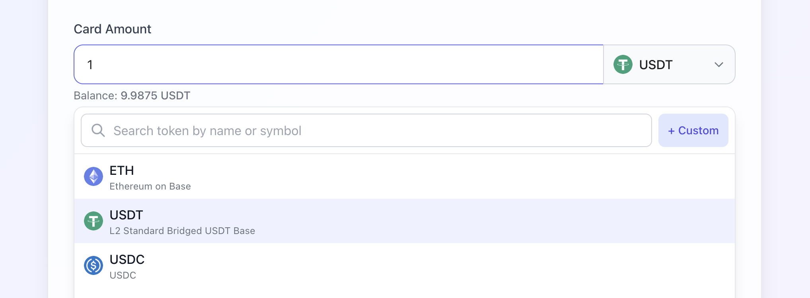
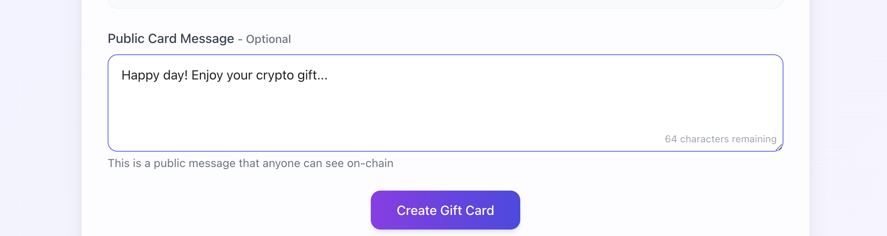
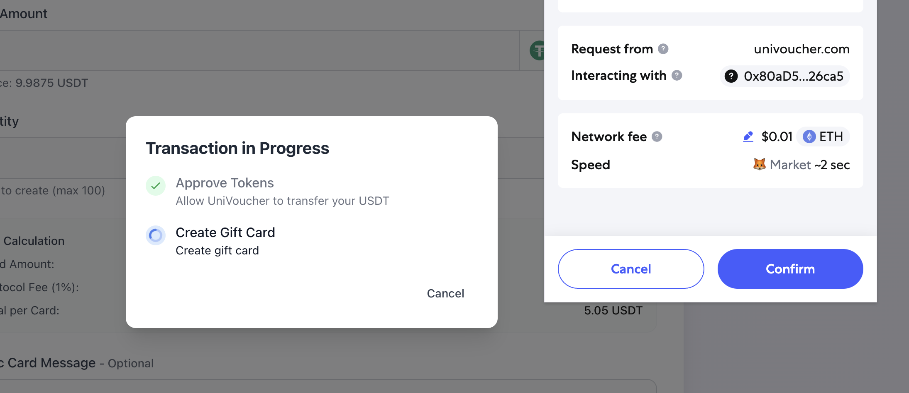
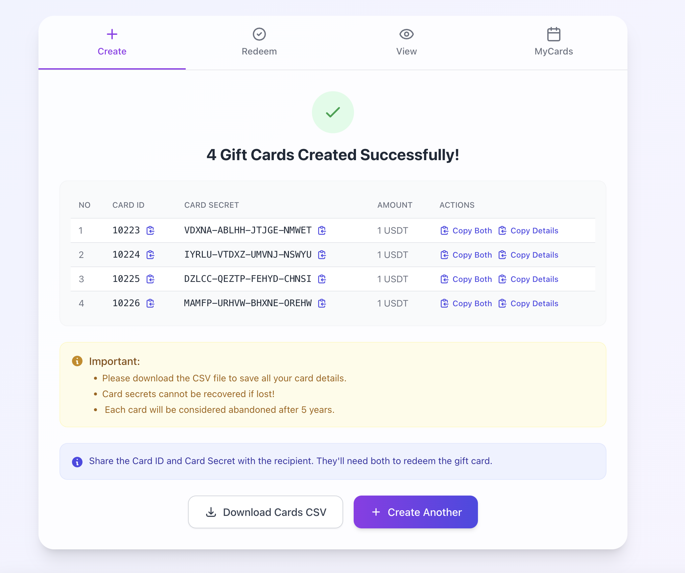
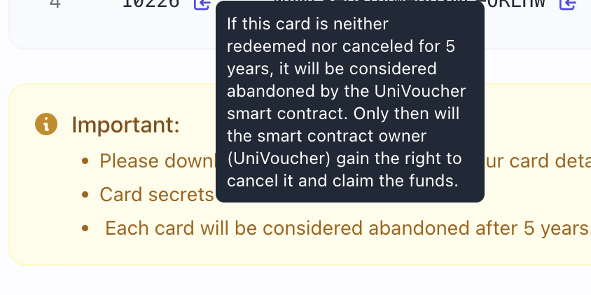

# Bulk Gift Card Creation

This guide explains how to create multiple crypto gift cards at once using UniVoucher's bulk creation feature.

!!! tip "When to Use Bulk Creation"
    Bulk creation is ideal for:

    - Corporate gifts for multiple employees
    - Event giveaways
    - Promotional campaigns
    - Family or group gifts
    - Community rewards

## How Bulk Creation Works

Unlike creating a single card, bulk creation allows you to:

1. Generate multiple gift cards in a single transaction
2. Create up to 100 cards at once
3. Apply the same token, amount, and message to all cards
4. Download all card details in a single file

## Bulk Creation Process

### Step 1: Navigate to the Create Tab

{: style="max-width: 40%"}

Click on the "Create" tab in the main navigation bar.

---

### Step 2: Select Token and Enter Amount

 **Select Token**: 

   - Choose the native token (like ETH, BNB, AVAX) 
   - Or select an ERC-20 token from the list
   - You can also add a custom token by entering the token address

**Enter Amount**:

- Input the amount you want for each individual card

---

### Step 3: Set Quantity

Change the "Quantity" field to your desired number (maximum 100 cards).

!!! note
    The same amount will be applied to each card. For example, if you set the amount to 0.1 ETH and quantity to 10, you'll create 10 cards each with 0.1 ETH.

---

### Step 4: Add an Optional Message (Applied to All Cards)

You can add a public message that will be included with all the gift cards (maximum 100 characters).

---

### Step 5: Review the Total Cost

The interface will display:

- Amount per card
- Fee per card (1% of the amount)
- Total cost per card (amount + fee)
- Total transaction value (cost per card × quantity)

!!! example "Cost Calculation Example"

    - Amount per card: 0.1 ETH
    - Fee per card: 0.001 ETH (1%)
    - Total per card: 0.101 ETH
    - Quantity: 10 cards
    - Total transaction value: 1.01 ETH

---

### Step 6: Create the Bulk Cards

Click the "Create Gift Cards" button, The system will:

1. Generate secure keypairs for each card
2. Create user-friendly secrets
3. Encrypt the private keys
4. Submit all the data in a single transaction

A progress indicator will show the generation status.

---

### Step 7: Confirm transactions

- For ERC-20 tokens, approve the token spending (if not already approved)
- Confirm the transaction in your wallet
- Wait for the transaction to be processed

---

### Step 8: Secure the Card Details

Once created, you'll see a table with all generated cards showing:

- Card ID
- Card Secret
- Amount

You have two options to save the information:

1. **Download CSV**: Get all card details in a comma-separated values file
2. **Copy Individual Cards**: Click the copy details icon next to any card

!!! danger "IMPORTANT"
    All card secrets are shown only once and cannot be recovered if lost. Make sure to securely save all card details immediately.

---

## Abandonment Protection

To prevent permanent fund loss, All cards include an abandonment protection mechanism.

!!! info "Abandonment process"
    - Cards inactive for 5 years are considered abandoned
    - The abandonment date is displayed on the card details
    - Only after this period, the contract owner can intervene
    - This is a safety mechanism to prevent permanent fund loss
    - In normal circumstances, you can cancel unredeemed cards at any time

---

## Monitoring Bulk Cards

You can track all your created cards in the "My Cards" section:

1. View redemption status of all cards
2. See which cards have been redeemed
3. Cancel unredeemed cards if needed
4. Export your card management data

!!! tip "Managing Your Cards"
    For detailed information about monitoring and managing your cards, including bulk operations, see our [Managing Your Cards Guide](managing-your-cards.md).

---

## Distribution Strategies

When distributing bulk gift cards, consider these approaches:

### Digital Distribution

- **Email**: Send individual cards via email
- **Messaging Apps**: Distribute through secure messaging
- **QR Codes**: Generate QR codes containing the card details

### Physical Distribution

- **Printed Cards**: Print physical cards with the ID and secret
- **Scratch Cards**: Create scratch-off cards that hide the secret
- **Gift Letters**: Include the card details in personalized letters