# Creating Gift Cards

This guide walks you through the process of creating tangible crypto gift cards using UniVoucher. You can create individual cards or multiple cards in bulk.

!!! tip "Prerequisites"
    Before creating a gift card, ensure you have:

    - A web3 wallet installed (like MetaMask, Coinbase Wallet, etc.)
    - The wallet connected to UniVoucher
    - Sufficient tokens for the card amount plus fees
    - Selected the correct network for your gift card

## Creating a Single Gift Card

### Step 1: Navigate to the Create Tab

{: style="max-width: 40%"}

Click on the "Create" tab in the main navigation bar.

---

### Step 2: Select Token and Enter Amount

- From the UniVoucher dashboard, click "Create Gift Card"
- Choose the native token (like ETH, BNB, AVAX) 
- Or select an ERC-20 token from the list 
- You can also add a custom token by clicking "Custom" and entering the token address

!!! note
    ERC-20 tokens require a one-time approval transaction before creating cards. You can approve a larger amount to avoid this step on future cards.

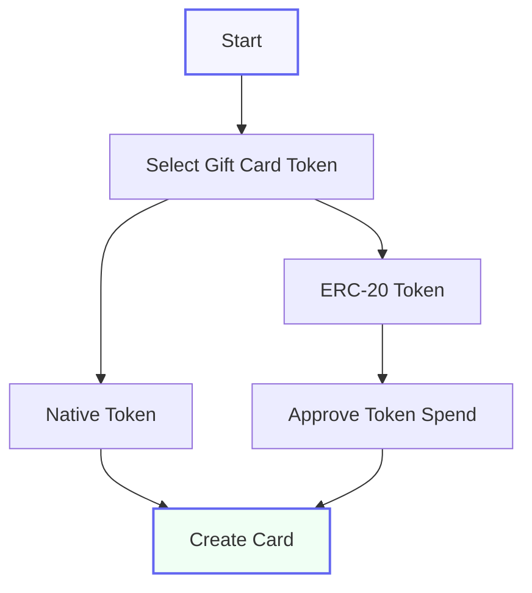

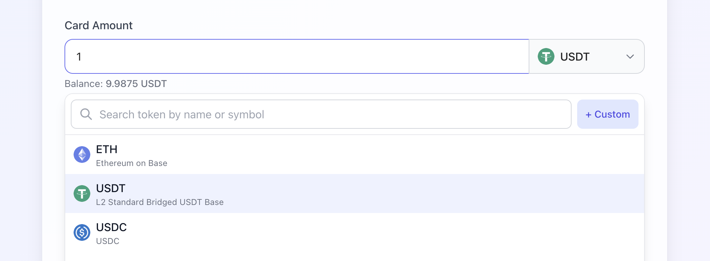

**Enter Amount**: Input the amount you want to add to the gift card

- Your current balance is displayed below the input
- The system automatically verifies you have sufficient balance (including fees)

---

### Step 3: Set Quantity (Optional)

By default, the quantity is set to 1 for a single card. You can change this if you want to create multiple identical cards. For detailed instructions on creating multiple cards at once, see our [Bulk Creation Guide](bulk-creation.md).

---

### Step 4: Add an Optional Message

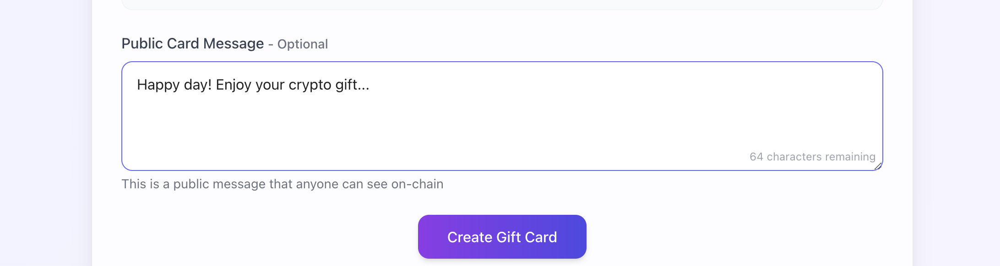

You can add a public message that will be stored with the gift card on the blockchain (maximum 100 characters).

---

### Step 5: Review and Create

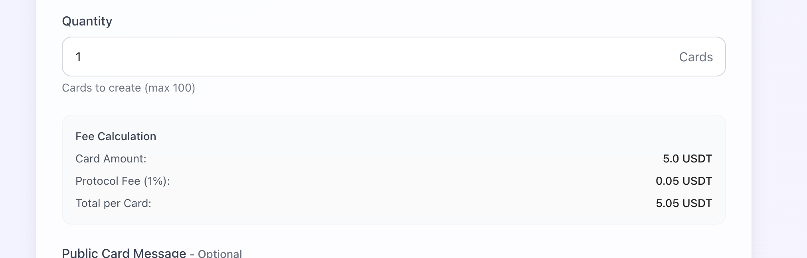

**Review the fee calculation details**

- Card Amount: The amount you specified
- Protocol Fee: Calculated as 1% of the card amount
- Total per Card: Amount + Fee

**Click the "Create Gift Card" button**

- This will prompt your wallet to confirm the transaction

**Confirm the transaction in your wallet**

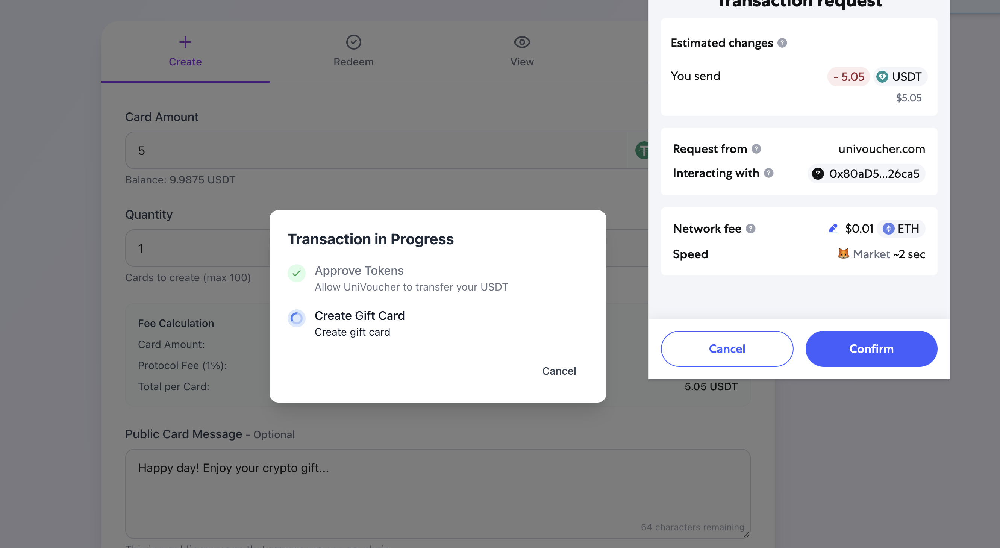

- For ERC-20 tokens, you may need to approve the token spending first
- Then confirm the actual card creation transaction

!!! warning "Important"
    - The transaction will need to be confirmed on the blockchain
    - Typical creation time: 15-60 seconds depending on network congestion
    - Keep your browser open until completion

---

### Step 6: Secure the Card Details

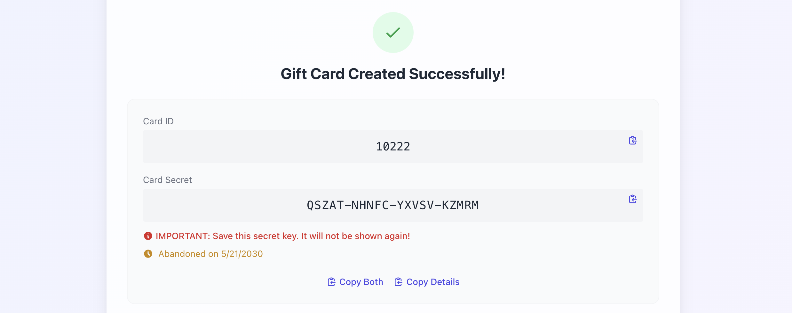

Once the transaction is confirmed, you'll see the gift card details:

- **Card ID**: A unique identifier for the gift card
- **Card Secret**: A 20-character secret in the format XXXXX-XXXXX-XXXXX-XXXXX

!!! danger "IMPORTANT"
    Save the card secret! It will not be shown again and cannot be recovered if lost.

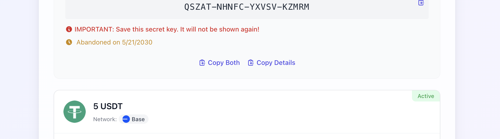

**You can:**

- Copy both the Card ID and Secret
- Download the card details as a text file
- View the full card details including amount, network, etc.

<!-- ## Creating Bulk Gift Cards

For creating multiple gift cards at once:

### Step 1: Follow the Same Initial Process

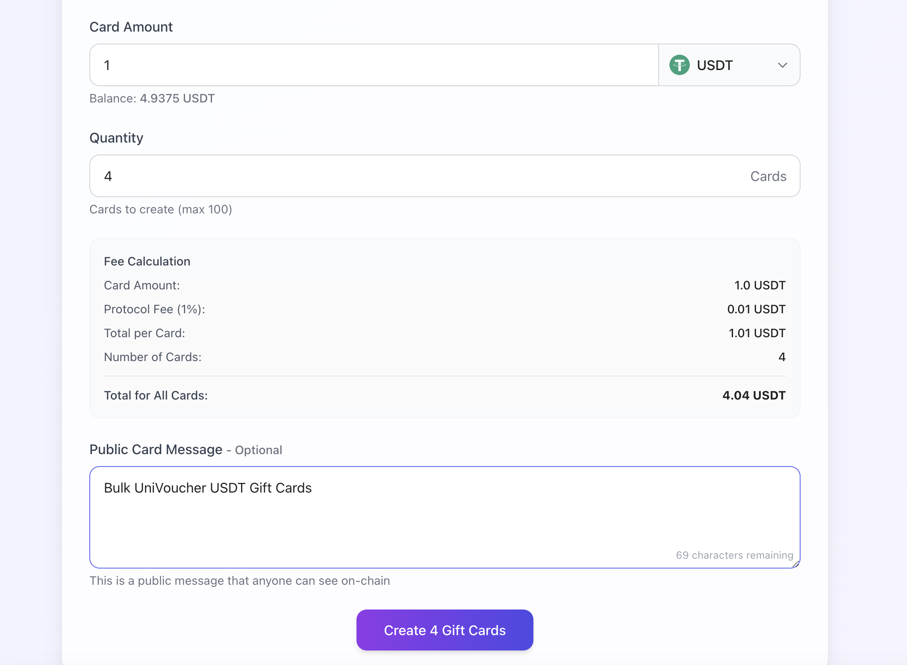

Follow the same process as creating a single card, but:

1. Set the "Quantity" field to the desired number of cards (maximum 100)
2. The same token and amount will be used for all cards
3. The same message will be applied to all cards

---

### Step 2: Confirm the Higher Transaction Value

The total transaction value will be:
- (Amount + Fee) × Number of cards

---

### Step 3: Wait for Card Generation

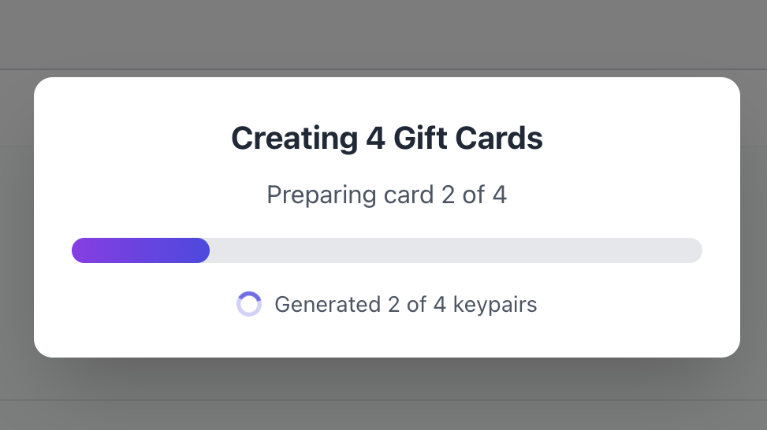

The system will:

1. Generate secure keypairs for each card
2. Create user-friendly secrets
3. Encrypt the private keys
4. Submit all the data in a single transaction

A progress indicator will show the generation status.

---

### Step 4: Secure the Card Details

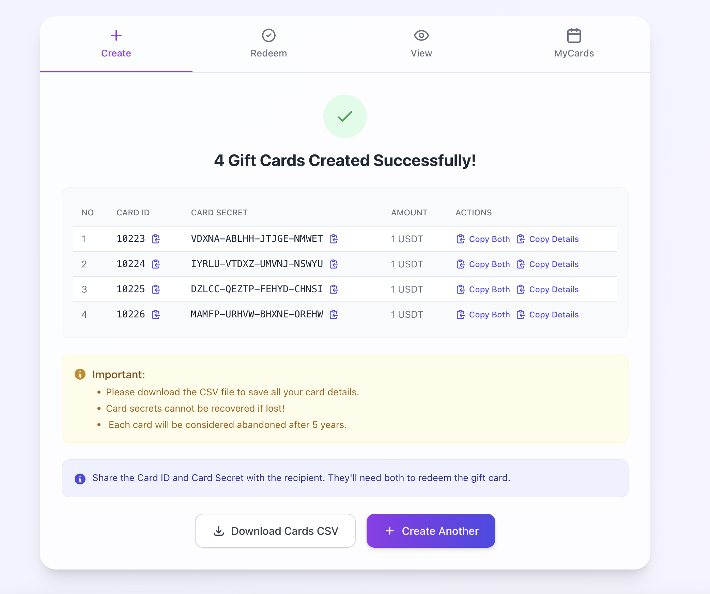

Once completed, you'll see a table with all card details:
- Card IDs
- Card Secrets
- Amounts

You can:
- Download all cards as a CSV file
- Copy individual card details
- Copy specific cards for distribution

!!! danger "IMPORTANT"
    Secure all card secrets immediately! They will not be shown again and cannot be recovered if lost. 

-->

## Fees and Security

### Fee Structure

UniVoucher charges a small fee for each card created:
- The fee is 1% of the card amount
- Paid in the same token as the card
- Added to the transaction value

### Security Best Practices

When distributing gift cards:

1. **Share Securely**: Send the card ID and secret through secure channels
2. **Separate Messages**: Consider sending the ID and secret through different channels
3. **Avoid Public Sharing**: Never share card secrets publicly
4. **Verify Redemption**: Ask recipients to confirm redemption
5. **Cancel if Needed**: You can cancel unredeemed cards if they were compromised

## Abandonment Protection

To prevent permanent fund loss, All cards include an abandonment protection mechanism.

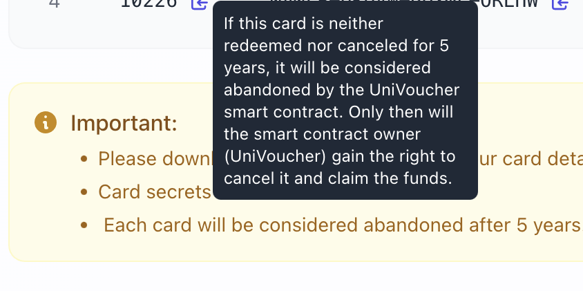

!!! info "Abandonment process"
    - Cards inactive for 5 years are considered abandoned
    - The abandonment date is displayed on the card details
    - Only after this period, the contract owner can intervene
    - This is a safety mechanism to prevent permanent fund loss
    - In normal circumstances, you can cancel unredeemed cards at any time
