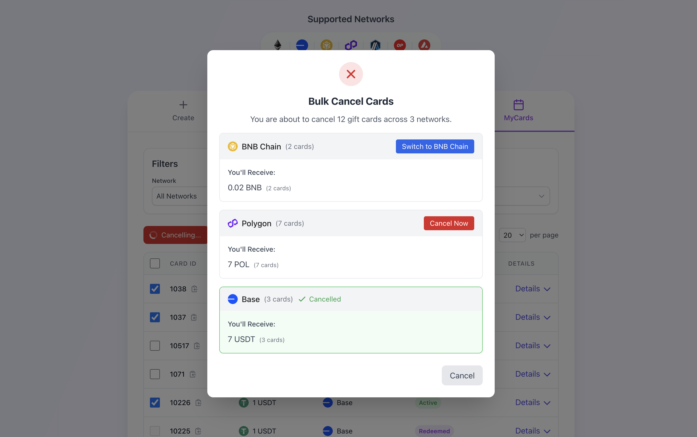

# Managing Your Cards

UniVoucher provides a "My Cards" dashboard that allows you to view, monitor, and cancel gift cards you've created or redeemed. This guide explains how to use these management features.

!!! note "Wallet Connection Required"
    To access your cards, you must connect the same wallet that was used to create or redeem them. All card management is tied to your wallet address.

## Accessing Your Cards

### Step 1: Connect Your Wallet

Click the "Connect Wallet" button in the top right corner and connect the same wallet you used to create or redeem cards.

---

### Step 2: Navigate to My Cards

{: style="max-width: 40%"}

Click the "My Cards" tab in the main navigation bar.

---

## The My Cards Dashboard

The dashboard displays all cards you've created across all supported networks:

- Cards are presented in a table format
- Each row represents a single card
- You can select multiple cards for bulk cancellation

---

### Card Information Displayed

For each card, the table shows:

- **Card ID**: The unique identifier for the card
- **Amount**: The token amount in the card
- **Network**: The blockchain network the card is on
- **Status**: Whether the card is Active, Redeemed, or Cancelled

---

### Viewing Detailed Card Information

To see more details about a specific card, Click the "Details" button or arrow on the card's row.

 The row expands to show additional information:

   - Card creation date
   - Token type and address
   - Message (if any)
   - Redemption or cancellation details (if applicable)
   - Technical details (public key, etc.)

---

## Cancelling Cards

### Cancelling Individual Cards

Each active card you created will show a "Cancel Card & Reclaim Funds" button when expanded:

1. Click the "Details" button to expand the card row
2. Click "Cancel Card & Reclaim Funds" at the bottom
3. Confirm the transaction in your wallet
4. Once confirmed, the funds will be returned to your wallet

---

### Bulk Cancellation

To cancel multiple cards at once:

1. Select cards using the checkboxes (only active cards you created)

2. Click "Cancel (X)" at the top (X = number of selected cards)

3. Review the cancellation modal showing grouped cards by network

4. For each network, click "Cancel Now" if connected or switch network first, then click "Cancel Now"

5. Confirm wallet transactions (one per network)

6. Click "Back to My Cards" when done

!!! tip "Gas Efficiency"
    Bulk cancellation is more gas-efficient than cancelling cards individually. If you have multiple cards to cancel on the same network, it's more cost-effective to cancel them in a single transaction.

---

## Network Considerations

!!! warning "Network Matching"
    To cancel cards, you must be connected to the same network as the cards. The dashboard will prompt you to switch networks when needed.

Important notes about network interaction:

- The dashboard shows cards from all networks, regardless of which network you're connected to
- To cancel cards, you must be connected to the same network as the cards
- The network indicator in the filter section shows when you're filtering for a different network than you're connected to
- Network switching prompts will appear when needed for cancellation operations

