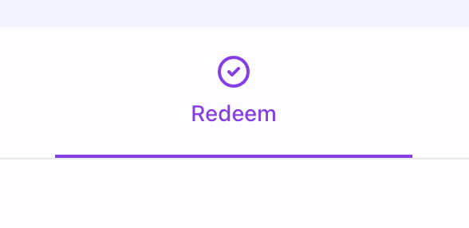
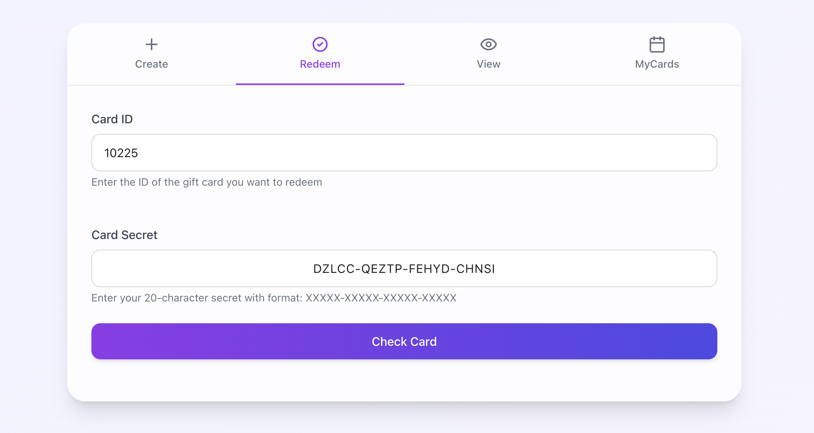
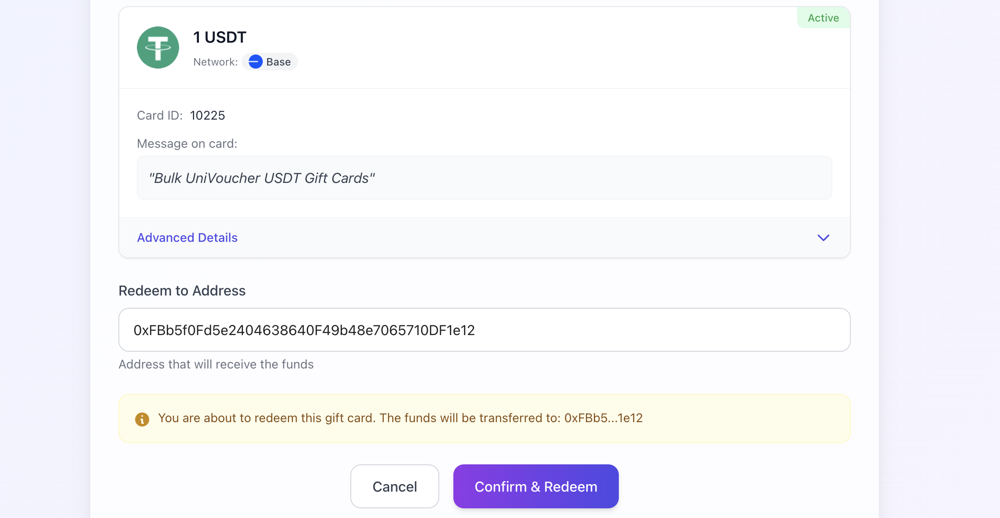
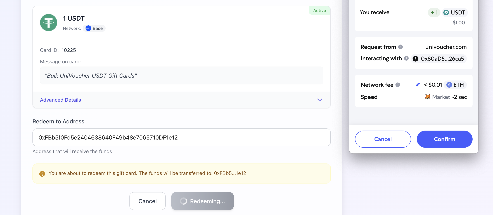
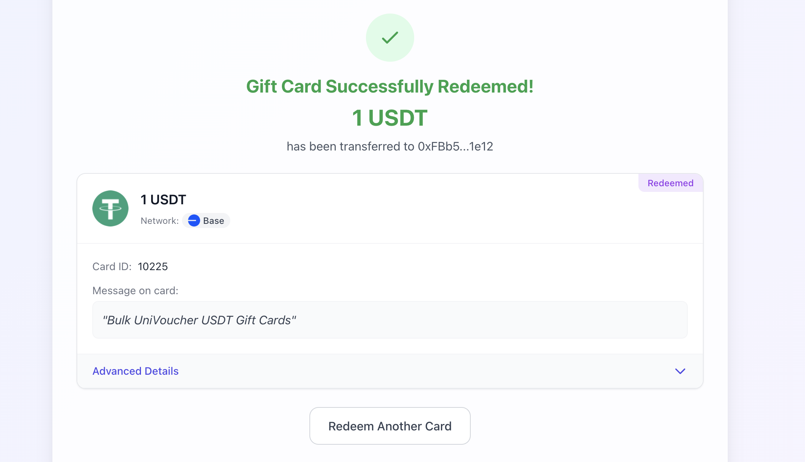

# Redeeming Gift Cards

This guide walks you through the process of redeeming a UniVoucher crypto gift card you've received.

!!! tip "Prerequisites"
    To redeem a gift card, you'll need:

    - The gift card ID (a numeric code)
    - The gift card secret (format: XXXXX-XXXXX-XXXXX-XXXXX)
    - A Web3 wallet (MetaMask, Coinbase Wallet, etc.)

## The Redemption Process

### Step 1: Navigate to the Redeem Tab

{: style="max-width: 40%"}

Go to [UniVoucher.com](https://univoucher.com) and click on the "Redeem" tab in the main navigation.

---

### Step 2: Enter Card Information

**Enter Card ID**:

   - Input the numeric Card ID you received
   - This is looks like 10266875

**Enter Card Secret**:

   - Type the 20-character secret code in the format XXXXX-XXXXX-XXXXX-XXXXX
   - The form will automatically add hyphens as you type

**Click "Check Card"**:

   - The system will verify if the card exists
   - It will also check if the provided secret is correct

---

### Step 3: Connect Your Wallet

If you haven't connected your wallet yet:

1. Click the "Connect Wallet" button
2. Select your wallet provider from the options
3. Complete the connection process in your wallet

!!! note
    If prompted to switch networks, please confirm the network switch. Gift cards must be redeemed on the same network they were created on.

---

### Step 4: Confirm Redemption Details

After card verification, you'll see:

- The card amount and token type
- The network the card is on
- Any message included with the card
- Other card details

The redemption address field will be pre-filled with your connected wallet address. You can:

- Use your connected wallet address (default)
- Enter a different recipient address if preferred

---

### Step 5: Confirm and Redeem

1. Click the "Confirm & Redeem" button
2. Confirm the transaction in your wallet

The redemption process:

- Uses the card secret to create a cryptographic signature
- Sends this signature to the smart contract for verification
- When verified, transfers the funds to your wallet

---

### Step 6: Redemption Confirmation

Once the transaction is confirmed on the blockchain:

- You'll see a success message
- The funds will be transferred to the specified wallet
- The card will be marked as redeemed and cannot be used again
- You can view the transaction details on the blockchain explorer

---

## Important Notes

- The card secret proves your right to redeem the card. Never share it with others.
- Each gift card can only be redeemed once.
- Make sure you're on the same network where the card was created.
- Redeeming requires a transaction on the blockchain, which incurs a small gas fee paid from your wallet.
- Cards don't expire and can be redeemed at any time (unless cancelled by the creator).

!!! info "What Happens Behind the Scenes"
    When you redeem a card:

    1. The UniVoucher interface uses the card secret to decrypt the card's private key
    2. The private key signs a message containing your wallet address
    3. The signature proves you know the secret without revealing it
    4. The smart contract verifies this signature
    5. Upon verification, the contract transfers the funds to your address
    6. The card is marked as redeemed on the blockchain
   
    This cryptographic process ensures that only someone with the correct secret can redeem the card.

## After Redemption

After successfully redeeming a card:

- The tokens will appear in your wallet (may take a minute to display)
- You can view the transaction on the blockchain explorer
- The card status will change to "Redeemed"
- The card creator will be able to see that the card was redeemed

!!! tip
    
    If you need to view the card details again later, you can use the "View" tab with just the card ID (no secret needed). For more information about viewing cards, see our [Viewing Gift Cards Guide](viewing-gift-cards.md).
