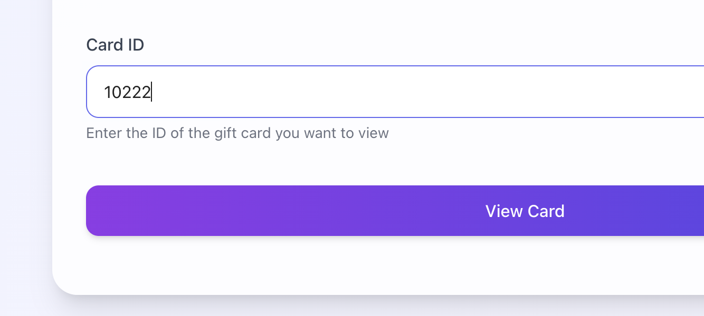
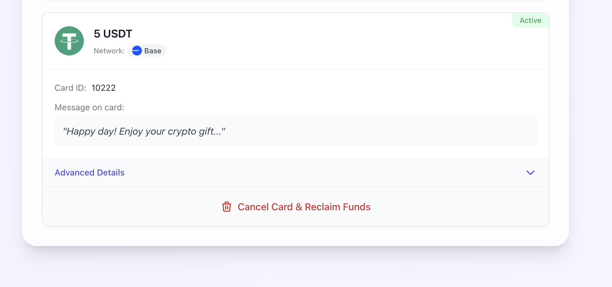
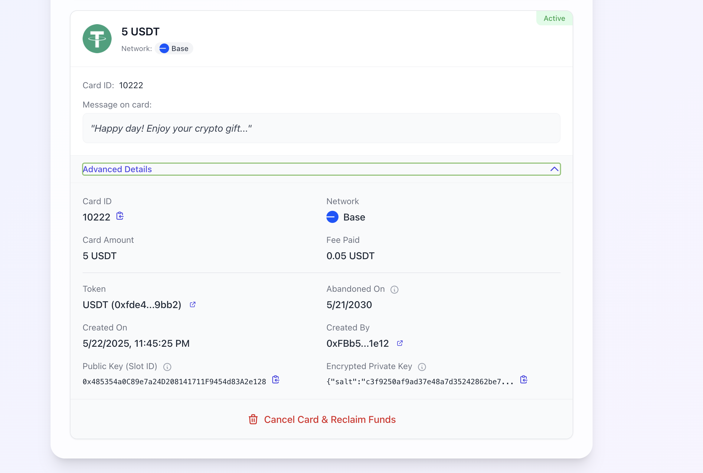

# Viewing Gift Cards

UniVoucher provides a dedicated card viewer that allows anyone to check the details of any UniVoucher tangible gift card using just the card ID. This page explains how to view card details and what information is available.

!!! tip "No Wallet Required"
    You can view basic card information without connecting a wallet or providing the card secret.
    This is useful for checking a card's status before attempting redemption.

## Viewing a Card

### Step 1: Navigate to the View Tab

{: style="max-width: 40%"}

Click on the "View" tab in the main navigation.

---

### Step 2: Enter Card ID

Enter the numeric Card ID in the input field.

---

### Step 3: Click "View Card"

Press the "View Card" button to retrieve the card details from the blockchain.

---

## Card Information Display

The card viewer shows comprehensive information about the gift card:

### Basic Card Information

- **Card ID**: The unique identifier for this card
- **Amount**: The token amount stored in the card
- **Token**: The token type (native token or ERC-20)
- **Network**: The blockchain network where the card exists
- **Status**: Current card status (Active, Redeemed, or Cancelled)
- **Message**: Any message included by the card creator

---

### Advanced Card Details

Clicking "Advanced Details" reveals additional information:

- **Card Creation Date**: When the card was created
- **Creator Address**: The wallet that created the card
- **Redeemer Address**: Who redeemed the card (if redeemed)
- **Redemption Date**: When the card was redeemed (if applicable)
- **Cancellation Info**: When and by whom the card was cancelled (if applicable)
- **Abandonment Date**: When the card would be considered abandoned (5 years after creation)
- **Public Key**: The card's slot ID (public key)
- **Token Address**: Contract address for ERC-20 tokens

---

### Blockchain Links

The viewer provides links to the blockchain explorer for:

- Viewing the transaction that created the card
- Examining the token contract (for ERC-20 tokens)
- Viewing the creator's address
- Viewing the redeemer's address (if redeemed)

---

## Card Status Indicators

The card viewer shows the current status of the card with a colored indicator:

- **Green**: Active (can be redeemed)
- **Purple**: Redeemed (has been claimed)
- **Red**: Cancelled (funds returned to creator)

---

## Cancelling Cards as Creator

If you're viewing a card you created:

1. Connect your wallet (must be the same wallet that created the card)
2. If the card is still active, a "Cancel Card & Reclaim Funds" button will appear
3. Click this button to initiate the cancellation process
4. Confirm the transaction in your wallet
5. Once confirmed, funds will be returned to your wallet

!!! warning "Cancellation Requirements"
    You can only cancel cards that:

    - You created (from the connected wallet)
    - Are still active (not redeemed)
    - Exist on the currently connected network

---

## Privacy Considerations

!!! info "Privacy Protection"
    The card viewer only reveals information that is publicly stored on the blockchain:
    
    - The card secret is never shown
    - Private keys are never exposed
    - Personal identification is not stored on-chain

This ensures that viewing a card doesn't compromise its security while still providing useful information.

## Common Use Cases for Card Viewing

The View tab is useful for:

- **Recipients**: Checking if a card is still active before attempting redemption
- **Creators**: Verifying card details before sharing
- **Anyone**: Looking up the status of a card by ID
- **Support**: Diagnosing issues with card redemption

## Cards Not Found

If the system cannot find a card with the provided ID, possible reasons include:

- The card ID was entered incorrectly
- The card was created very recently and hasn't propagated to all interfaces
- The card ID does not exist

Try verifying the ID with the person who shared it with you.
