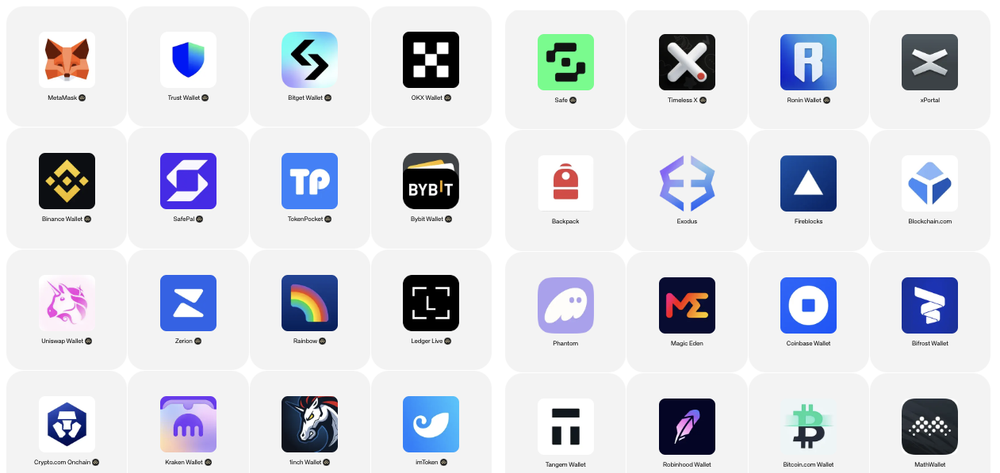
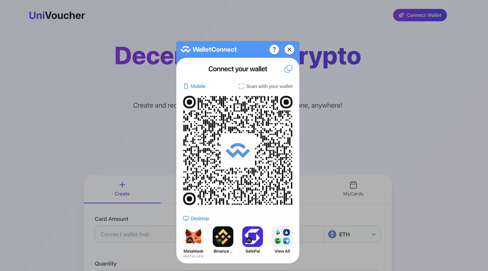
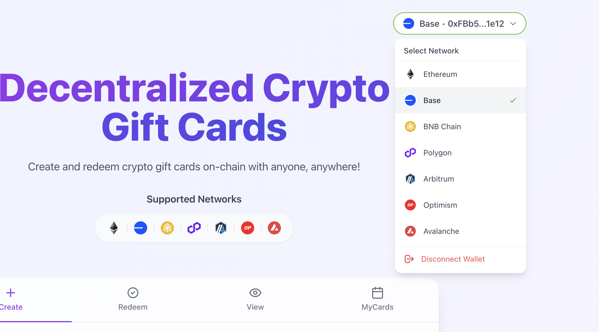

# Wallet Connection

UniVoucher interacts with blockchain networks through your Web3 wallet. This guide explains how to connect your wallet and manage network connections. As a fully decentralized protocol, UniVoucher requires no account registration - simply connect your wallet to access the platform from anywhere in the world.

!!! info "No Account Required"
    UniVoucher is a fully decentralized application. You don't need to create an account or provide personal information - your wallet is your identity.

## Supported Wallets

UniVoucher supports a wide range of Ethereum-compatible wallets, including:

- MetaMask
- Coinbase Wallet
- WalletConnect
- Rainbow
- Trust Wallet
- And many other Web3 wallets

## Connecting Your Wallet

### Step 1: Click the Connect Button

In the top right corner of the UniVoucher interface, click the "Connect Wallet" button.

### Step 2: Select Your Wallet

A modal will appear with available wallet options:

- Choose your preferred wallet from the list
- If you don't see your wallet, click "view all"
- For mobile wallets, scan the WalletConnect QR code

### Step 3: Approve the Connection

In your wallet application:

1. Review the connection request
2. Ensure the domain is `univoucher.com`
3. Approve the connection

!!! warning "Security Check"
    Always verify you're connecting to the correct website. Check that the URL is `univoucher.com` before approving any wallet connection.

### Step 4: Select an Account

If your wallet contains multiple accounts:

1. Choose which account to connect
2. This account will be used for all operations

Once connected, the interface will display your connected address and network in the top right corner.

## Managing Networks

### Current Network Display

After connecting, the current network is displayed in the top right corner:

- Network name (e.g., "Ethereum", "Polygon")
- Your wallet address (abbreviated)

### Switching Networks

To switch to a different network:

1. Click on the network name/address button in the top right
2. Select the desired network from the dropdown
3. Confirm the network switch in your wallet

### Automatic Network Switching

UniVoucher will automatically prompt you to switch networks when:

- Redeeming a card that exists on a different network
- Cancelling cards that exist on a different network

These prompts will appear as needed during operations.

## Network-Specific Operations

Different operations have different network requirements:

| Operation | Network Requirement |
|-----------|---------------------|
| Creating cards | Must be connected to the desired network |
| Redeeming cards | Must be connected to the network where the card exists |
| Viewing cards | No specific network connection required |
| Managing cards | Can view cards from all networks, but must switch to cancel |

## Disconnecting Your Wallet

To disconnect your wallet:

1. Click on your address/network button in the top right
2. Select "Disconnect Wallet" at the bottom of the dropdown
3. Your wallet will be disconnected from the site

## Wallet Status Indicators

The interface provides visual indicators of your wallet status:

- **Connected**: Shows network name and abbreviated address
- **Wrong Network**: Shows warning when you need to switch networks
- **Disconnected**: Shows "Connect Wallet" button

## Security Best Practices

!!! danger "Wallet Security"
    When using Web3 wallets with UniVoucher:

    1. **Verify the URL**: Always ensure you're on `univoucher.com` before connecting
    2. **Review Transactions**: Carefully check all transaction details before signing
    3. **Use Hardware Wallets**: For large transactions, consider using a hardware wallet

## Common Wallet Issues

| Issue | Solution |
|-------|----------|
| Wallet not connecting | Refresh the page and try again |
| Network switch failing | Manually switch in your wallet, then retry |
| Transaction stuck | Check your wallet for pending transactions |
| Account not showing | Ensure the account is active in your wallet |
| Mobile connection issues | Try using WalletConnect or the wallet's built-in browser |

## Network Gas Fees

Each transaction on the blockchain requires gas fees:

- Gas fees are paid in the native token of the network (e.g., ETH on Ethereum)
- Fee amounts vary by network and current congestion
- The connected wallet must have sufficient funds for gas
- UniVoucher does not charge additional fees beyond the 1% card creation fee

!!! info "Privacy Considerations"
    When connecting your wallet to UniVoucher:

    - Your wallet address becomes visible on the blockchain for transactions you perform
    - Cards you create are linked to your address on-chain
    - Your address is used to retrieve your created cards in the My Cards section
    - No personal information beyond your wallet address is collected or stored
    - No centralized database of user information
    - No KYC or identity verification required
    - Accessible to anyone, anywhere in the world
